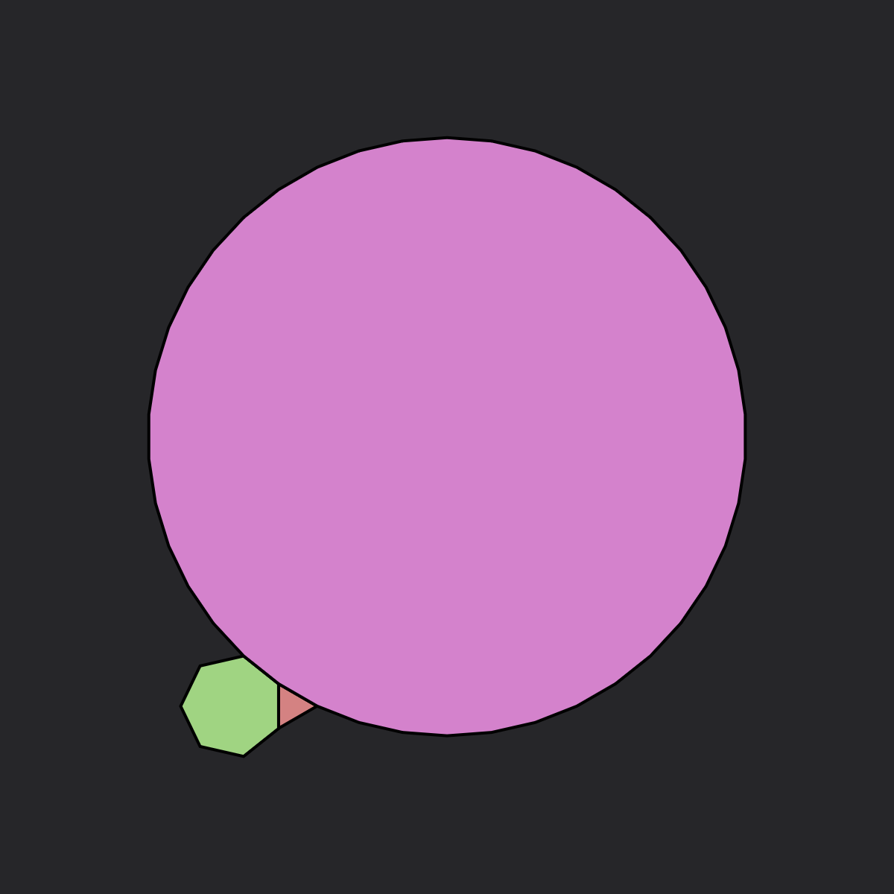
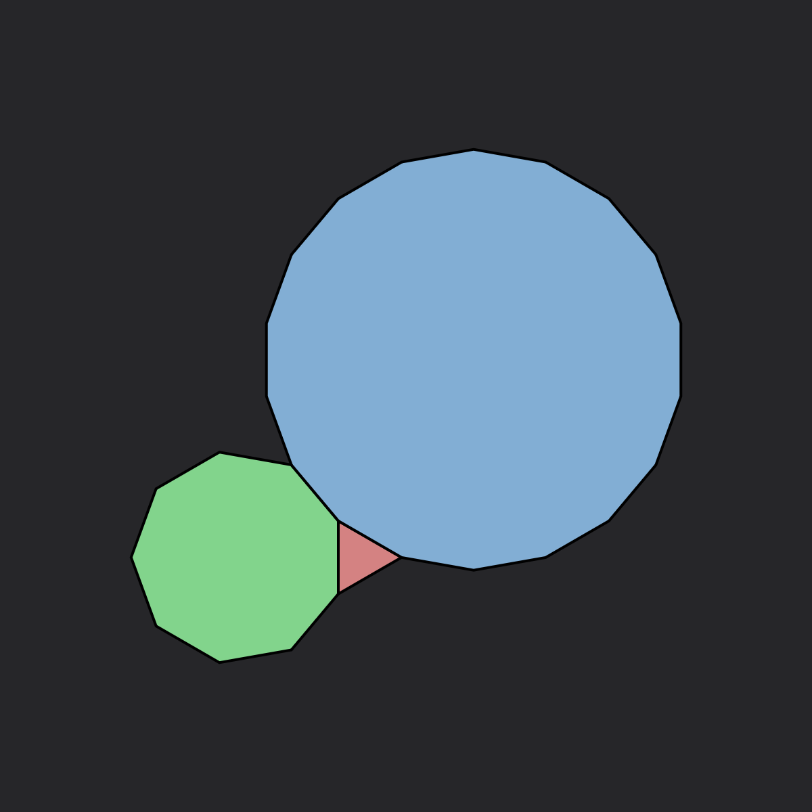

# Tilings

## Classification

A tiling is a covering of the plane using one or more geometric shapes, called tiles, with no overlaps and no gaps. In mathematics, tilings are studied in various contexts and have applications in crystallography, material science, and art.

### The 15 valid vertex shapes

When trying to analyze tilings in a rigorous way, the first thing we need to consider is how many ways there are to build vertices, i.e. what are the different combinations of regular polygons that, when wrapped around a point, cover exactly 360°.

Turns out that there are only 21 ways to do that:

{.cols-10}
| # | | | | | | | | | | |
| :---: | :---: | :---: | :---: | :---: | :---: | :---: | :---: | :---: | :---: | :---: |
| $3$ |  |  |  |  |  |  |  |  |  |  |
| | $\color{red}{3.7.42}$ | $\color{red}{3.8.24}$ | $\color{red}{3.9.18}$ | $\color{red}{3.10.15}$ | $\color{green}{3.12^2}$ | $\color{red}{4.5.20}$ | $\color{green}{4.6.12}$ | $\color{green}{4.8^2}$ | $\color{red}{5^2.10}$ | $\color{green}{6^3}$ |
| $4$ |  |  |  |  |  |  |  | | | |
| | $\color{green}{3.4.3.12}$ | $\color{green}{3.4.6.4}$ | $\color{green}{3.4^2.6}$ | $\color{green}{3^2.4.12}$ | $\color{green}{3^2.6^2}$ | $\color{green}{3.6.3.6}$ | $\color{green}{4^4}$ | | | |
| $5$ |  |  |  | | | | | | | |
| | $\color{green}{3^2.4.3.4}$ | $\color{green}{3^3.4^2}$ | $\color{green}{3^4.6}$ | | | | | | | |
| $6$ |  | | | | | | | | | |
| | $\color{green}{3^6}$ | | | | | | | | | |

Of which only 15 can generate valid tilings (in green).

### Regular Tilings

Regular tilings are composed of regular polygons arranged in a way that every vertex looks the same. There are only three regular tilings of the plane: triangular, square, and hexagonal.

| .png) | .png) | .png) |
| :---: | :---: | :---: |
| $3^6$ | $4^4$ | $6^3$ |

### Semi-Regular Tilings

Semi-regular tilings use two or more regular polygons, with the same arrangement of polygons at each vertex. There are eight semi-regular tilings (also known as Archimedean tilings):

| .png) | .png) | .png) | .png) | 
| :---: | :---: | :---: | :---: |
| $3^4.6$ (Snub trihexagonal)| $3^3.4^2$ (Elongated triangular) | $3^2.4.3.4$ (Snub square) | $3.4.6.4$ (Rhombitrihexagonal) |
| .png) | .png) | .png) | .png) | 
| $(3.6)^2$ (Trihexagonal) | $3.12^2$ (Truncated hexagonal) | $4.6.12$ (Truncated trihexagonal) | $4.8^2$ (Truncated square) |

Tilings can be categorized based on various properties:

### Symmetry Groups

Tilings can be classified by their symmetry groups. The 17 wallpaper groups describe all possible symmetry types of periodic tilings in the Euclidean plane.

### Regularity

Tilings can be regular, semi-regular, demi-regular, or irregular based on the types of polygons used and vertex configurations.

### Periodicity

Periodic tilings repeat in a regular pattern, while aperiodic tilings (like Penrose tilings) do not have translational symmetry.

## Generation Method

In this application, we generate tilings using a systematic approach based on mathematical rules:

### Rule Strings

The rule strings define the base shape, orientation, and transformations to generate a specific tiling pattern. For example, "4/m45/r(h1)" defines a square tiling with a 45-degree rotation.

### Transformations

We apply transformations like rotations, translations, and reflections to create complex patterns from simple base shapes. The number of transformation steps determines the complexity of the resulting pattern.

# Conway's Game of Life

The Game of Life is a cellular automaton devised by mathematician John Conway in 1970. It's a zero-player game where evolution is determined by the initial state.

## Original Definition

### Rules

The classic Game of Life follows the B3/S23 rule:
- A dead cell with exactly 3 live neighbors becomes alive (Birth).
- A live cell with 2 or 3 live neighbors survives (Survival).
- In all other cases, cells die or remain dead.

### Patterns

Various patterns can emerge:
- Still lifes: Patterns that don't change
- Oscillators: Patterns that repeat after a fixed number of generations
- Spaceships: Patterns that translate across the grid
- Methuselahs: Patterns that evolve for many generations before stabilizing

## Extensions Implemented

We've implemented several extensions to the classic Game of Life:

### Generations

In Generations rules (like "B36/S23/6"), dying cells go through multiple states before disappearing completely, creating colorful patterns that show the history of the simulation.

### Larger Than Life

Larger Than Life rules extend the neighborhood beyond the immediate 8 cells, allowing for more complex interactions and emergent behaviors.

### Non-Square Tilings

Our implementation allows cellular automata to run on various tiling patterns beyond the traditional square grid, including triangular, hexagonal, and more complex tilings.

# Our study

## Idea

