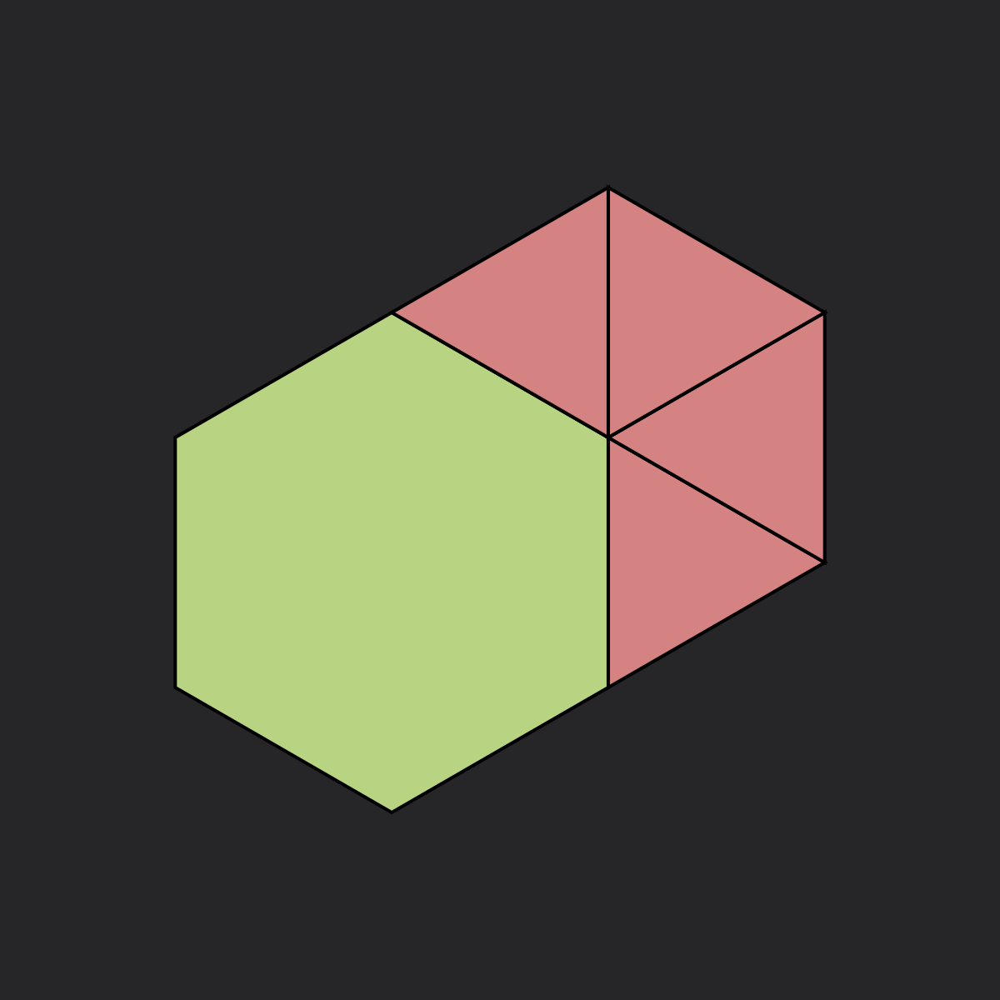

# Theory

## Tilings

### Classification

A tiling is a covering of the plane using one or more geometric shapes, called tiles, with no overlaps and no gaps. In mathematics, tilings are studied in various contexts and have applications in crystallography, material science, and art.

Tilings can be categorized based on various properties, including:

#### Symmetry Groups

Tilings can be classified by their symmetry groups. The 17 wallpaper groups describe all possible symmetry types of periodic tilings in the Euclidean plane.

#### Regularity

Tilings can be regular, semi-regular, demi-regular, or irregular based on the types of polygons used and vertex configurations.

#### Periodicity

Periodic tilings repeat in a regular pattern, while aperiodic tilings (like Penrose tilings) do not have translational symmetry.

#### Tile type

Tilings can consist of curved shapes, regular or irregular polygons, convex or concave shapes. They can be edge-to-edge, or non edge-to-edge, where you can shift tiles so that their sides don't align with each other.

For now, we only have $k$-uniform periodic tilings available, which are the easiest and most "regular" kind of tiling there is, but in the future we plan on introducing more types and ways to construct them.

To explain what a $k$-uniform tiling is, we first need to understand what a vertex configuration is.

#### The 15 valid vertex configurations

The first thing we need to consider is how many ways there are to build vertices, i.e. what are the different combinations of regular polygons that, when wrapped around a point, cover exactly 360°.

Turns out that there are only 21 ways to do that:

| # | | | | | | | | | | |
| :---: | :---: | :---: | :---: | :---: | :---: | :---: | :---: | :---: | :---: | :---: |
| $3$ |  |  |  |  |  |  |  |  |  |  |
| | $\textcolor{lightcoral}{3.7.42}$ | $\textcolor{lightcoral}{3.8.24}$ | $\textcolor{lightcoral}{3.9.18}$ | $\textcolor{lightcoral}{3.10.15}$ | $\textcolor{lightgreen}{3.12^2}$ | $\textcolor{lightcoral}{4.5.20}$ | $\textcolor{lightgreen}{4.6.12}$ | $\textcolor{lightgreen}{4.8^2}$ | $\textcolor{lightcoral}{5^2.10}$ | $\textcolor{lightgreen}{6^3}$ |
| $4$ |  |  |  |  |  |  |  | | | |
| | $\textcolor{lightgreen}{3.4.3.12}$ | $\textcolor{lightgreen}{3.4.6.4}$ | $\textcolor{lightgreen}{3.4^2.6}$ | $\textcolor{lightgreen}{3^2.4.12}$ | $\textcolor{lightgreen}{3^2.6^2}$ | $\textcolor{lightgreen}{3.6.3.6}$ | $\textcolor{lightgreen}{4^4}$ | | | |
| $5$ |  |  |  | | | | | | | |
| | $\textcolor{lightgreen}{3^2.4.3.4}$ | $\textcolor{lightgreen}{3^3.4^2}$ | $\textcolor{lightgreen}{3^4.6}$ | | | | | | | |
| $6$ |  | | | | | | | | | |
| | $\textcolor{lightgreen}{3^6}$ | | | | | | | | | |

Of which only 15 can generate valid tilings (in green). If you start by laying out any of the other 6, you'll quickly discover that there's no way to continue adding tiles without overlapping them or leaving empty space between them.

A $k$-uniform tiling is then an edge-to-edge periodic tiling that contains $k$ vertex configurations such that each of them can not be mapped, via a combination of translation and rotation, to another. This means that a $k$-uniform tiling can have less than $k$ distinct vertex configurations.

A tiling that has exactly $k$ distinct configurations is called $k$-archimedean.

Here's the table with the tiling count for each combination of number of total vertex configurations $k\le6$ and distinct vertex configurations $m\le6$.

| $k$ / $m$ |  1  |  2  |  3  |  4  |  5  |  6  | Total |
|:---------:|:---:|:---:|:---:|:---:|:---:|:---:|:-----:|
|     1     | 11  |  0  |  0  |  0  |  0  |  0  |  11   |
|     2     |  0  | 20  |  0  |  0  |  0  |  0  |  20   |
|     3     |  0  | 22  | 39  |  0  |  0  |  0  |  61   |
|     4     |  0  | 33  | 85  | 33  |  0  |  0  |  151  |
|     5     |  0  | 74  | 149 | 94  | 15  |  0  |  332  |
|     6     |  0  | 100 | 284 | 187 | 92  | 10  |  673  |
|   Total   | 11  | ∞   | ∞   | ∞   | ∞   | ∞   |  ∞    |

#### Regular Tilings

**Regular tilings** are $1$-uniform tilings composed of regular polygons arranged in a way that every vertex looks the same. There are only $3$ regular tilings of the plane: triangular, square, and hexagonal.

| .webp) | .webp) | .webp) |
| :---: | :---: | :---: |
| $3^6$ | $4^4$ | $6^3$ |

#### Semi-Regular Tilings

The other eight $1$-uniform tilings are called **Semi-regular** tilings, but they consists of two or more regular polygons.

| .webp) | .webp) | .webp) | .webp) |
| :---: | :---: | :---: | :---: |
| $3^4.6$ (Snub trihexagonal)| $3^3.4^2$ (Elongated triangular) | $3^2.4.3.4$ (Snub square) | $3.4.6.4$ (Rhombitrihexagonal) |
| .webp) | .webp) | .webp) | .webp) |
| $(3.6)^2$ (Trihexagonal) | $3.12^2$ (Truncated hexagonal) | $4.6.12$ (Truncated trihexagonal) | $4.8^2$ (Truncated square) |

Currently, our tiling catalogue contains all $k$-uniform tilings up to $k=3$, and some for $k=4,5$ and $6$.

### GomJau-Hogg Generation Method

In this application, we generate tilings using a systematic approach based on the GomJau-Hogg notation:

#### Seed

Each tiling can be expressed with a string of characters which defines the base shape, called **seed**, and a set of transformations, all divided by the "/" character.

The seed is composed by groups, divided by the hyphen "-", which are further divided in shapes by a comma ",", where the numbers represents the number of sides.

After the first group, which can only consists of one shape (the central tile), each new one starts laying the tiles clockwise from the top, aligning them edge-to-edge to the free sides. Note that $0$ can be used as a placeholder to skip one side we don't want to cover.

```ad-example
Example

The following seed:

$$\text{4-3,3-6-4,3}$$

is composed by three groups of one (red square), two (green triangles), one (blue hexagon) and two (pink) shapes each.


```

#### Geometrical transformation

Once the seed is laid out, the algorithm proceeds to perform the geometrical transformations, which are:

- mirroring, represented by the letter $m$
- rotations, represented by the letter $r$
- translations (added by us to make the notations more flexible), represented by the letter $t$

What follows encodes the geometrical entity that the transformation is operated with respect to. It can be:

- a line: a number represents its inclination (in degrees), and the transformation is repeated doubling the angle until it reaches $360\degree$
- a point: a letter represents the type ($v$ for vertex, $h$ for halfway point, $c$ for centroid) and a following number represents its ordering when counting clockwise from the top

The list of transformations can be repeated any number of times. With every additional iteration, the tiling grows more and more.

```ad-example
Example

For example:

$$
\text{4/m45/r(h1)}
$$

Here:
- $4$ is the seed: just one square
- $m45$ defines a set of mirroring trasformations starting from $45\degree$
- $r(h1)$ defines a rotation around the first halfway point found in a clockwise order starting from the top, i.e. the midpoint of the square's top side

.png)
```

This simple setup allows to construct all $k$-uniform tilings.

## Conway's Game of Life

### Definition

Conway's Game of Life is a two-dimensional cellular automaton created by John
Conway in 1970. It's a zero-player game where evolution is determined by the initial state.
Despite its very simple rules, it exhibits complex and often unpredictable behaviors.

In its original version, the Game of Life operates on an infinite grid of
square cells. Each cell can be in one of two states: dead or alive. At every
iteration, the state of each cell evolves according to the following rules:

- Any alive cell with fewer than 2 alive neighbors dies (underpopulation).
- Any alive cell with 2 or 3 alive neighbors survives to the next generation.
- Any alive cell with more than 3 alive neighbors dies (overpopulation).
- Any dead cell with exactly 3 alive neighbors becomes alive (reproduction).

These transition rules are concisely described by the string **B3/S23**, where
**B3** indicates birth on exactly three neighbors, and **S23** indicates
survival on two or three neighbors.


#### Patterns

Various patterns can emerge:

- Still lifes: Patterns that don't change from one iteration to the other
    
- Oscillators: Patterns that repeat after a fixed number of generations
    
- Spaceships: Patterns that translate across the grid
    
- Methuselahs: Patterns that evolve for many generations before stabilizing


### Extensions

We also explored some extensions of the Game of Life:

#### Generations

In the "Generations" variant, cells can pass through intermediate states between
alive and dead before fully transitioning. Each cell is associated with a small integer
counter that represents its "age".
Rules specify both birth thresholds and decay durations,
producing interesting phenomena that are not possible
in the binary model.


#### Larger than Life

"Larger than Life" generalizes the neighborhood radius beyond the immediate
adjacent cells. Instead of counting only the eight nearest neighbors, these
rules consider all cells within a specified radius *r* on the grid, with
distinct birth and survival intervals defined over that neighborhood.

#### Non-square grids

The underlying grid can be replaced by arbitrary tilings or graphs, allowing
each cell to have a non-uniform number of neighbors. Examples include hexagonal
tilings, Penrose tilings, and irregular networks. Despite the change in
topology, the life-like rules (B/S strings) apply uniformly based on each
cell's local neighbor count, unlocking new pattern classes and emergent
structures.


### Searching for interesting rules

One thing that one can realize while trying rules and tilings on the simulator
is that it is really hard to find interesting rules, especially on complex
tilings.

In order to define what a rule should satisfy to be "interesting", we
used the following metrics:

#### Used metrics

These metrics are presented in **Life Worth Mentioning: Complexity in Life-Like Cellular Automata**
Peña et al.

To systematically compare the dynamical regimes generated by different rules,
the authors employ two complementary information-theoretic metrics computed on each
configuration:

- **Density ($\rho$).** The fraction of live cells in the system,
  $$
  \rho=\dfrac{1}{N}\sum_i s_i
  $$
  where $s_i\in\{0,1\}$ and $N$ is the total
  number of cells. Density measures the overall activity or fill ratio.

- **Statistical complexity ($D$).** The difference between the marginal entropy
  of the cell-state distribution,
  $$
  H(S)=-\rho\log_2\rho - (1-\rho)\log_2(1-\rho)
  $$
  and the average conditional entropy given a neighboring cell,

  $$
  G=\langle H(S|U)\rangle, \quad H(S|U)=-\sum_{s,u}P(s,u)\log_2\dfrac{P(s,u)}{P(u)}
  $$

  so that $D=H(S)-G$. Larger $D$ indicates more non-random spatial organization
  beyond what is expected from density alone.

By plotting rules in the 2D density–complexity plane, they managed to find similar
behaviors and identify those that produce the richest dynamics, such as
**B3/S23**.

We tried to use these metrics to search for interesting rules on non-square
tilings.

#### Parallel computing

Let us now think about the number of iterations of the automaton we need to compute.

1. 1000 iterations
2. 100 random starts
3. all possible rules, which is $2^{2(n+1)}$, where $n$ is the maximum number of neighbors
of each cell (all combinations of $2^{n+1}$ birth rules and $2^{n+1}$ survival rules).

It is easy to see that this number is very big, making the computation impossible
to be ran sequentially.

The strategy that we employed to run the simulation is to parallelize it as much
as possible. In order to do this, we used the Taichi framework running on a machine
using a GPU card.

The cellular state array is stored as a field on the GPU, and all the update rules
and metric computations as expressed as Taichi kernels, that are then ran in
parallel.

More practically, what happens is this:

- Using the current frame state, all the alive neighbor counts are computed
in parallel, for all the cells and for all the random starts.
- Using the neighbor counts, the state of the next iteration is computed in
parallel, according to the rule that is being tested.
- The current frame is discarded and replaced by the one just created,
and the metrics are computed.

This procedure is then applied for each rule and for each tiling.

The code responsible for this part is `tiling_metrics.py`, which loads the
tiling exported from the web simulator and runs the simulation.

In order to run this code on a machine with a powerful GPU, we made use of the cluster
provided by DTU. The file responsible for creating the job that runs the simulation
is `job.lsf`.

#### Results

We ran the simulation on 3 different tilings. We put a limit of 8 maximum neighbors
on all of them (meaning that rules with more than 8 neighbors were not considered).

The tilings that were used are the following:

- Triangular
- Square
- Hexagonal

##### Triangular
The plot for the Density and complexity for the triangular tiling is the following:


It is possible to see that some clusters emerge. We can Zoom in into the Game-of-Life
rule, to see some rules that should be similar:


Same thing is done for the Square and Hexagonal tiling

##### Square


##### Hexagonal


#### Interpretation of the results

It is very interesting to see that cluster emerge from the used metrics. Unfortunately,
even the rules that are close to Game-of-Life, don't present any life-like behavior,
and most of the times die immediately or fill the grid with living cells.

> What could cause this?

#### Future work

> More metrics, (CNN, GNN etc..)

