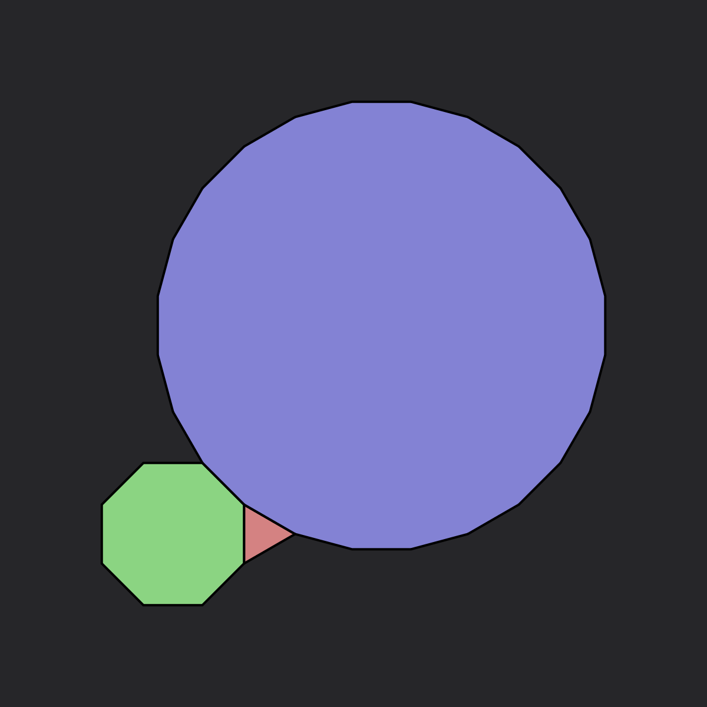
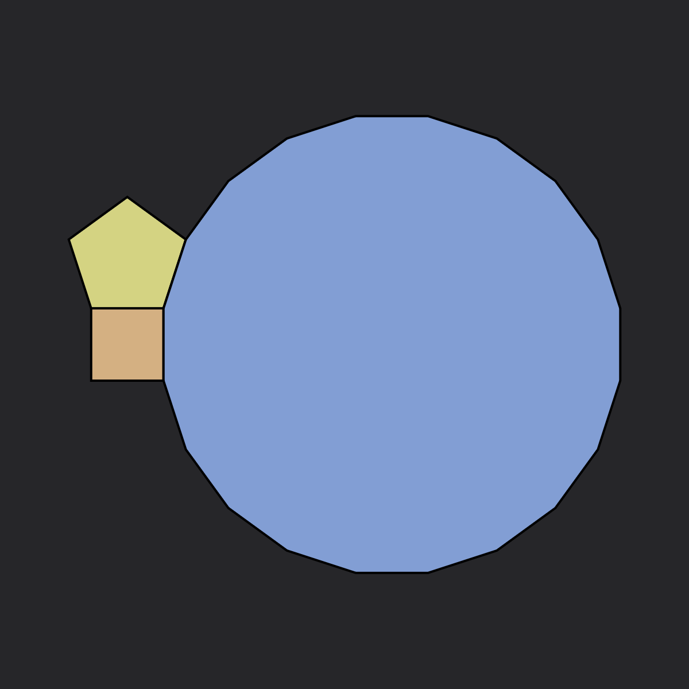
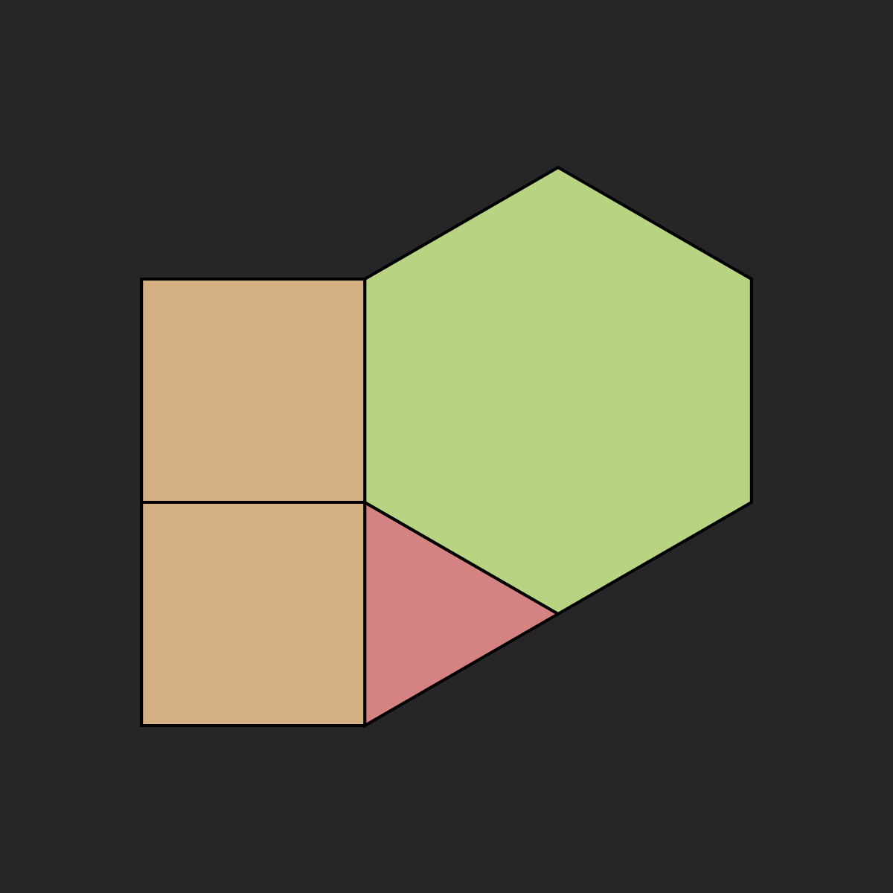

# Tilings

## Classification

A tiling is a covering of the plane using one or more geometric shapes, called tiles, with no overlaps and no gaps. In mathematics, tilings are studied in various contexts and have applications in crystallography, material science, and art.

### The 15 valid vertex shapes

When trying to analyze tilings in a rigorous way, the first thing we need to consider is how many ways there are to build vertices, i.e. what are the different combinations of regular polygons that, when wrapped around a point, cover exactly 360°.

Turns out that there are only 21 ways to do that:

| # | | | | | | | | | | |
| :---: | :---: | :---: | :---: | :---: | :---: | :---: | :---: | :---: | :---: | :---: |
| $3$ |  |  |  |  |  |  |  |  |  |  |
| | $\textcolor{lightcoral}{3.7.42}$ | $\textcolor{lightcoral}{3.8.24}$ | $\textcolor{lightcoral}{3.9.18}$ | $\textcolor{lightcoral}{3.10.15}$ | $\textcolor{lightgreen}{3.12^2}$ | $\textcolor{lightcoral}{4.5.20}$ | $\textcolor{lightgreen}{4.6.12}$ | $\textcolor{lightgreen}{4.8^2}$ | $\textcolor{lightcoral}{5^2.10}$ | $\textcolor{lightgreen}{6^3}$ |
| $4$ |  |  |  |  |  |  |  | | | |
| | $\textcolor{lightgreen}{3.4.3.12}$ | $\textcolor{lightgreen}{3.4.6.4}$ | $\textcolor{lightgreen}{3.4^2.6}$ | $\textcolor{lightgreen}{3^2.4.12}$ | $\textcolor{lightgreen}{3^2.6^2}$ | $\textcolor{lightgreen}{3.6.3.6}$ | $\textcolor{lightgreen}{4^4}$ | | | |
| $5$ |  |  |  | | | | | | | |
| | $\textcolor{lightgreen}{3^2.4.3.4}$ | $\textcolor{lightgreen}{3^3.4^2}$ | $\textcolor{lightgreen}{3^4.6}$ | | | | | | | |
| $6$ |  | | | | | | | | | |
| | $\textcolor{lightgreen}{3^6}$ | | | | | | | | | |

Of which only 15 can generate valid tilings (in green).

### Regular Tilings

Regular tilings are composed of regular polygons arranged in a way that every vertex looks the same. There are only three regular tilings of the plane: triangular, square, and hexagonal.

| .png) | .png) | .png) |
| :---: | :---: | :---: |
| $3^6$ | $4^4$ | $6^3$ |

### Semi-Regular Tilings

Semi-regular tilings use two or more regular polygons, with the same arrangement of polygons at each vertex. There are eight semi-regular tilings (also known as Archimedean tilings):

| .png) | .png) | .png) | .png) |
| :---: | :---: | :---: | :---: |
| $3^4.6$ (Snub trihexagonal)| $3^3.4^2$ (Elongated triangular) | $3^2.4.3.4$ (Snub square) | $3.4.6.4$ (Rhombitrihexagonal) |
| .png) | .png) | .png) | .png) |
| $(3.6)^2$ (Trihexagonal) | $3.12^2$ (Truncated hexagonal) | $4.6.12$ (Truncated trihexagonal) | $4.8^2$ (Truncated square) |

Tilings can be categorized based on various properties:

### Symmetry Groups

Tilings can be classified by their symmetry groups. The 17 wallpaper groups describe all possible symmetry types of periodic tilings in the Euclidean plane.

### Regularity

Tilings can be regular, semi-regular, demi-regular, or irregular based on the types of polygons used and vertex configurations.

### Periodicity

Periodic tilings repeat in a regular pattern, while aperiodic tilings (like Penrose tilings) do not have translational symmetry.

## Generation Method

In this application, we generate tilings using a systematic approach based on mathematical rules:

### Rule Strings

The rule strings define the base shape, orientation, and transformations to generate a specific tiling pattern. For example,

$$
\text{4/m45/r(h1)}
$$

defines a square tiling with a 45-degree rotation.

### Transformations

We apply transformations like rotations, translations, and reflections to create complex patterns from simple base shapes. The number of transformation steps determines the complexity of the resulting pattern.

# Conway's Game of Life

## Definition
Conway's Game of Life is a two-dimensional cellular automaton created by John
Conway in 1970. It's a zero-player game where evolution is determined by the initial state.
Despite its very simple rules, it exhibits complex and often unpredictable behaviors.

In its original version, the Game of Life operates on an infinite grid of
square cells. Each cell can be in one of two states: dead or alive. At every
iteration, the state of each cell evolves according to the following rules:

* Any alive cell with fewer than 2 alive neighbors dies (underpopulation).
* Any alive cell with 2 or 3 alive neighbors survives to the next generation.
* Any alive cell with more than 3 alive neighbors dies (overpopulation).
* Any dead cell with exactly 3 alive neighbors becomes alive (reproduction).

These transition rules are concisely described by the string **B3/S23**, where
**B3** indicates birth on exactly three neighbors, and **S23** indicates
survival on two or three neighbors.

### Patterns

Various patterns can emerge:

* Still lifes: Patterns that don't change
* Oscillators: Patterns that repeat after a fixed number of generations
* Spaceships: Patterns that translate across the grid
* Methuselahs: Patterns that evolve for many generations before stabilizing

## Extensions
We also explored some extensions of the Game of Life:

### Generations

In "Generations" variants, cells can pass through intermediate states between
alive and dead before fully transitioning. Each cell is associated with a small integer
counter that represents its "age".
Rules specify both birth thresholds and decay durations,
producing interesting phenomena that are not possible
in the binary model.

### Larger than Life

"Larger than Life" generalizes the neighborhood radius beyond the immediate
adjacent cells. Instead of counting only the eight nearest neighbors, these
rules consider all cells within a specified radius *r* on the grid, with
distinct birth and survival intervals defined over that neighborhood.

### Non-square grids

The underlying grid can be replaced by arbitrary tilings or graphs, allowing
each cell to have a non-uniform number of neighbors. Examples include hexagonal
tilings, Penrose tilings, and irregular networks. Despite the change in
topology, the life-like rules (B/S strings) apply uniformly based on each
cell's local neighbor count, unlocking new pattern classes and emergent
structures.

In our project we used 

## Searching for interesting rules

In order to find interesting rules for non-square grids and 

### Used metrics

To systematically compare the dynamical regimes generated by different rules,
we employ two complementary information-theoretic metrics computed on each
configuration:

* **Density ($\rho$).** The fraction of live cells in the system,
  $$
  \rho=\dfrac{1}{N}\sum_i s_i
  $$
  where $s_i\in\{0,1\}$ and $N$ is the total
  number of cells. Density measures the overall activity or fill ratio.

* **Statistical complexity ($D$).** The difference between the marginal entropy
  of the cell-state distribution,
  $$
  H(S)=-\rho\log_2\rho - (1-\rho)\log_2(1-\rho)
  $$
  and the average conditional entropy given a neighboring cell,

  $$
  G=\langle H(S|U)\rangle, \quad H(S|U)=-\sum_{s,u}P(s,u)\log_2\dfrac{P(s,u)}{P(u)}
  $$

  so that $D=H(S)-G$. Larger $D$ indicates more non-random spatial organization
  beyond what is expected from density alone.

By plotting rules in the 2D density–complexity plane, we can cluster similar
behaviors and identify those that produce the richest dynamics, such as
**B3/S23**.

We tried to use these metrics to search for diff

### Parallel computing

Our implementation uses the Taichi language to exploit GPU parallelism. The
cellular state array is stored as a field on the GPU, and update rules,
neighbor counts, and metric calculations are all expressed as Taichi kernels.
Each kernel launches thousands of threads to process cells or edges in
parallel, ensuring that even large graphs or high iteration counts complete
efficiently. Atomic operations accumulate joint probabilities for the
complexity metric, while in-place buffer swaps implement the Life update with
minimal synchronization overhead.

### Plots
Put plots and the interpretation of them

### Future work

